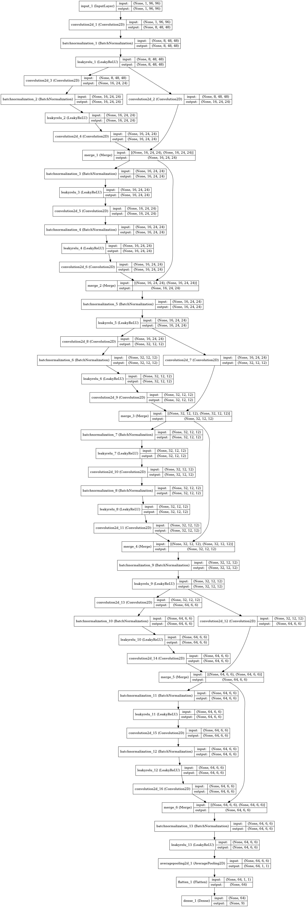

# [「人工知能は名刺をどこまで解読できるのか？！」](http://jp.corp-sansan.com/lp/data-sientist-c.html) ベンチマークコード

## Dependencies
* numpy
* pandas
* Python Imaging Library(PIL)
* keras
* theano (もしくはTensorFlow)

## 実行方法

### 前準備
[コンペページからデータをダウンロード](https://deepanalytics.jp/compe/26/download)して
`trainer.py` と同じディレクトリに解凍・配置してください。
訓練用画像データは解凍時ディレクトリ3個に分割されていますが、1個のディレクトリにまとめてください。
`trainer.py`の19〜22行で読み込むcsvファイルと画像ディレクトリを指定しています。環境が異なる場合は変更してください。

また、kerasで[cuDNN](https://developer.nvidia.com/cudnn)を使うtheanoでの設定例を `dot.theanorc` に用意してあります。
どうぞご参考にしてください。

### 実行

以下のコマンドで訓練を実行した後に予測をファイル(`prediction.csv`)に書き出します。
```
$ ./trainer.py
```
AWS g2.8xlargeインスタンス(NVIDIA GRID K520)では30分程度で終了します。

予測ファイル `prediction.csv` は応募用フォーマットに従っていますので、
[データ投稿ページ](https://deepanalytics.jp/compe/26/subscription)から提出可能です。


## 使用アルゴリズム
名刺画像から切り抜いた長方形の矩形領域を96x96の正方形にリサイズし、畳み込みニューラルネットワークの入力としています。
畳み込みニューラルネットワークは下図のResidual Networkを使用しています。
ベンチマーク目的のため、比較的浅い(8層)構成にしてあります。


